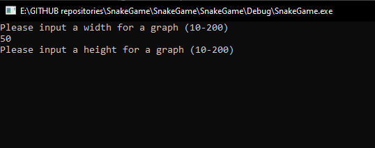
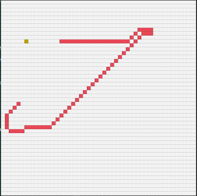
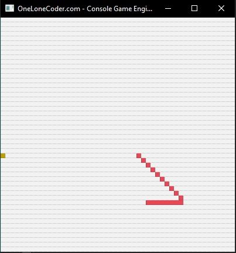

# Snake game simulation
The food placement is random, the snake's movement isn't!

The movement is based on the A* search algorithm.

## The Interface

    

First the player chooses the dimensions of the board on the console.

    

Then a new graphical window appears to demonstrate the snake movement.

    

*© Copyright Andrew Coachman 2021, all rights included*